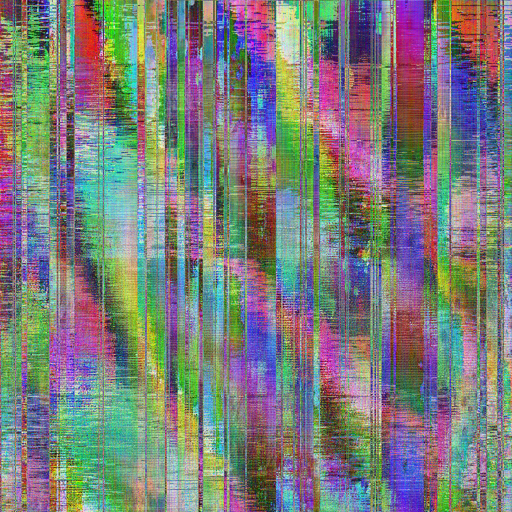
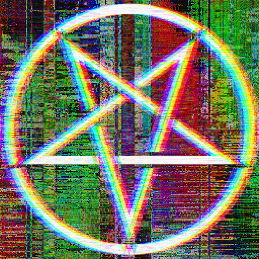
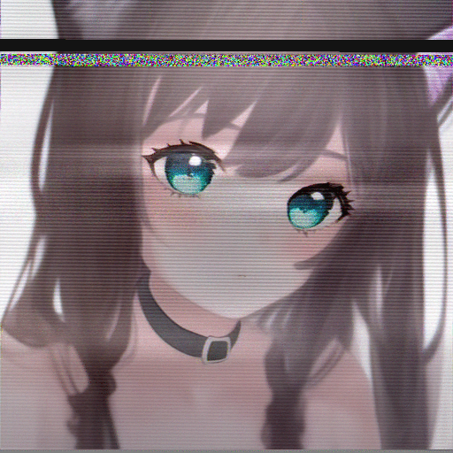
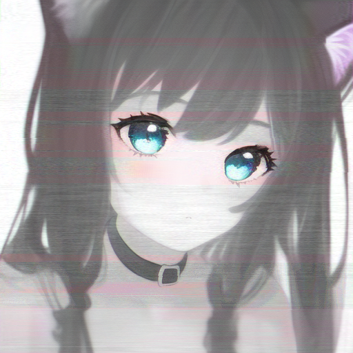
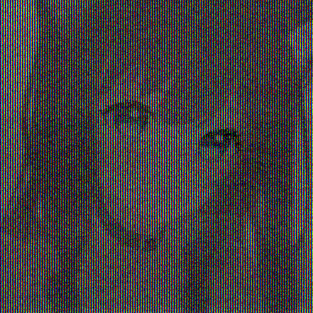

# examples

## scripts

### "buzz"
- script is `buzz.lua`, input manifest is `buzz.json`
- invoke with `cherenkov -i buzz.json -o buzz.bmp -l buzz.lua`
  - you can also explicitly invoke with `cherenkov -i source/explosionslider.mp3 -t audio -o buzz.bmp -l buzz.lua -O channels=1 -O data_rate=48 -O data_format=u8`

### cherenkov logo
based on the code for "buzz"
- script is `logo.lua`, input manifest is `logo.json`
- invoke with `cherenkov -i logo.json -o logo.bmp -l logo.lua`

## no script?

to run cherenkov without a script, you must specify a preset with the `-p` flag (and should specify a type with the `-t` flag if the input file is an `image` or `audio`), such as in `cherenkov -i source/cat.png -t image -p super -o cat_out.bmp`. this will pick random instructions from the preset

by default, 8 operations are performed. to change the number of operations, use the `generations` option. options can be set with the `-O` flag, such as in `cherenkov -i source/cat.png -t image -p super -O generations=16 -o cat_out.bmp`

the rng seed will be printed at the beginning of a run. you can use the same seed again with the `-s` flag

valid presets include `super`, `deepfry`, `audio`, `crunch`, and `classic`

### examples

examples will be using this source image (originally generated using novelai)

- `cherenkov -i source/cat.png -t image -p classic -o scriptless/example0.bmp`
   
  seed: `fd197ad439ed2ef3e801b64a3b3a2116e1c9385e8889d9179f1e8063ada09ab0`

- `cherenkov -i source/cat.png -t image -p super -o scriptless/example1.bmp`
   
  seed: `251896e09256f64836f4476d20bef9599e4ab7525202fafd996ef7f3f570ece6`

- `cherenkov -i source/cat.png -t image -p super -O generations=4 -o scriptless/example2.bmp`
   
  seed: `cb575bbd61592edcb41b39ddfb7aecb0c7bb8579743ba533a8e294cb959ebdb2`

- `cherenkov -i source/cat.png -t image -p deepfry -O generations=64 -o scriptless/example3.bmp`
   
  seed: `1b3f4a29e2a52fcfe5503561e28e4b997307840b305f88a6d130080eb9cf608b`

- `cherenkov -i source/cat.png -t image -p crunch -O generations=4 -o scriptless/example4.bmp`
   
  seed: `c7c5ce4319fd8a641ee857860687ab290579b3c2f89ca0d80ab39a3d995517b6`